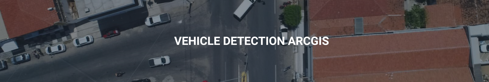

# Vehicle Detection with ArcGIS

This repository houses the work for my thesis for the specialization in geoprocessing and georeferencing at UFERSA, where I trained a model for vehicle detection and counting directly in ArcGIS Pro. The project is divided into several steps, each represented by a Jupyter notebook:

1. [`vehicle_detection_deploy.py`](https://github.com/jvataidee/VehicleDetectionArcGIS/blob/master/vehicle_detection_deploy.py): vehicle_detection_deploy.py
2. [`training_model_tracking_fasterRCNN.ipynb`](https://github.com/jvataidee/VehicleDetectionArcGIS/blob/master/training_model_tracking_fasterRCNN.ipynb): This notebook is likely where the machine learning model is trained. It probably involves loading the data, creating the model, and training the model using the data.

## Background

This project utilizes the following technologies:

- Python
- Numpy
- OpenCV
- ArcGIS Pro
- ArcGIS Learn

## Author

João Ataíde, Data Scientist at Imagem Esri.

For more information about me and my work, please visit my [Blog](http://joaoataide.com) or [LinkedIn](https://www.linkedin.com/in/jvataide/).

If you have any questions, feel free to reach out via email: [contato@joaoataide.com](mailto:contato@joaoataide.com).
