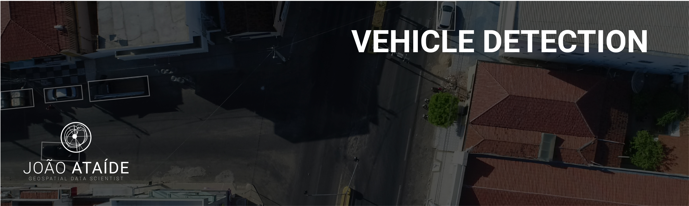

  

# João Ataíde
*Cientista de Dados na Imagem Esri*

---
Esse aqui é meu reporitório do trabalho de conclusão de curso da especialização em geoprocessamento e georreferênciamento na UFERSA, neste realizei o treinamento de um modelo de detecção e contagem de veículos diretamente no ArcGIS Pro, aqui você vai encontrar todos os notebooks de todas a etapas que foram realizadas para chegar ao resultado.

**Background in:** Python, ArcGIS Pro, ArcGIS Learn.

**Links:**
* [Blog](https://www.joaoataide.com)
* [LinkedIn](https://www.linkedin.com/in/joaoataidee/)
* e_mail: contato@joaoataide.com

---
